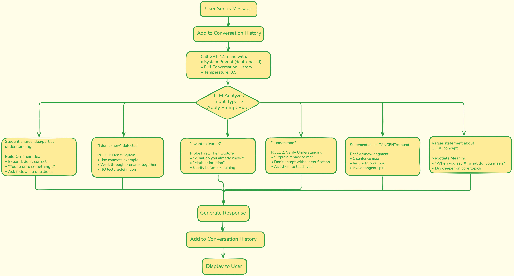

# Collaborative ML/DS Learning System

A Streamlit-based collaborative learning application that uses GPT-4.1-nano to help students, graduates, and researchers learn Machine Learning and Data Science concepts through guided exploration rather than direct instruction.

---

## Setup Instructions

### Prerequisites
- Python 3.8 or higher
- OpenAI API key

### Installation

1. **Clone the repository**
```bash
git clone https://github.com/arbaazali872/collaborative_learning_agent.git
cd collaborative_learning_agent
```

2. **Install dependencies**
```bash
pip install -r requirements.txt
```

3. **Set up OpenAI API key**

Create a `.streamlit/secrets.toml` file in the project root:
```toml
OPENAI_API_KEY = "your_api_key_here"
```

### Running the Application

```bash
streamlit run app.py
```

The application will open in your default browser at `http://localhost:8501`

---

## System Architecture

### Core Components



The system consists of four main layers:
1. **Streamlit UI**: Chat interface with depth selection and session controls
2. **Prompt Engineering Layer**: Collaboration rules and depth-specific instructions
3. **LLM Integration**: OpenAI GPT-4.1-nano with configured parameters
4. **RAG System**: ChromaDB for conversation persistence and retrieval

### Key Files

- **`app.py`**: Main Streamlit application, handles UI and user interactions
- **`prompts.py`**: System prompts and collaboration rules for different learning depths
- **`requirements.txt`**: Python dependencies

### Workflow

1. **User Input**: Student selects learning depth (Interview/Exam/Research) and asks a question
2. **Prompt Construction**: System combines base collaboration rules with depth-specific instructions
3. **LLM Processing**: GPT-4.1-nano generates response following collaborative behaviors
4. **Special Features**:
   - **Review Session**: Summarizes all discussed topics, allows revisiting
   - **Topic Recall**: Retrieves specific saved understanding from past conversations

### Depth Levels

The system adapts its interaction style based on the selected depth:

| Depth | Target User | Style | Math Content |
|-------|-------------|-------|--------------|
| **Interview** | Job candidates | Concise, practical, focus on when/why to use concepts | Minimal |
| **Exam** | Students | Balanced theory + application, includes edge cases | Moderate |
| **Research** | Researchers | Rigorous, mathematical formulation with formal notation | Heavy |

### Collaboration Mechanism

The system implements five critical rules to enforce collaborative learning:

1. **Probe First**: When user asks "I want to learn X", probe their existing knowledge before explaining
2. **Concrete Examples**: When user says "I don't know", work through specific scenarios with numbers
3. **Ground in Concrete**: Use examples as primary teaching method, not abstract definitions
4. **Co-Explore**: Build on student ideas, don't lecture or provide complete solutions
5. **Verify Understanding**: Before moving on, ask student to explain the concept back

---

## Technology Stack

- **Frontend**: Streamlit
- **LLM**: OpenAI GPT-4.1-nano (via API)
- **Vector Store**: ChromaDB
- **Language**: Python 3.8+

---

## Notes

- The system requires an active internet connection for OpenAI API calls
- ChromaDB data persists locally in `./chroma_db` directory between sessions
- Temperature is set to 0.5 to balance creativity with adherence to collaboration rules
- Maximum response length is 2000 tokens